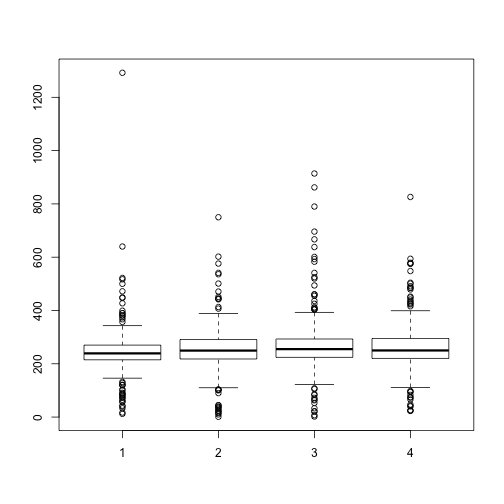
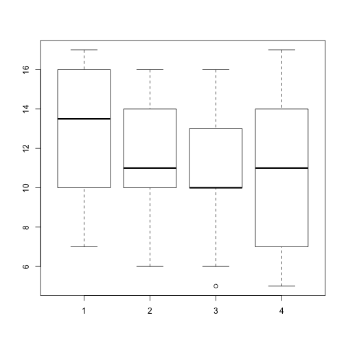

KIDMID RT analyses.
========================================================


```r
setwd("~/Documents/STANFORD/FYP/KIDMID/Analysis/RT")
d1 = read.csv("RT_15subjects_20-Jan-2103.csv")
d2 = read.csv("accuracy_15subjects20-Jan-2014.csv")
```


```r
# exclude subject 007
d1 = subset(d1, !(d1$Subject %in% c("7")))
d2 = subset(d2, !(d2$Subject %in% c("7")))

d1[d1 == 0] <- NA  #change zeros to NA
rt_barplot = with(d1, boxplot(gain, loss, nongain, nonloss))
```

 

```r
gain.mean = mean(d1$gain, na.rm = TRUE)
loss.mean = mean(d1$loss, na.rm = TRUE)
nongain.mean = mean(d1$nongain, na.rm = TRUE)
nonloss.mean = mean(d1$nonloss, na.rm = TRUE)
```


## RT t-tests


```r
t.test(d1$gain, d1$nongain, na.rm = TRUE)
```

```
## 
## 	Welch Two Sample t-test
## 
## data:  d1$gain and d1$nongain
## t = -2.718, df = 469.8, p-value = 0.006815
## alternative hypothesis: true difference in means is not equal to 0
## 95 percent confidence interval:
##  -48.810  -7.846
## sample estimates:
## mean of x mean of y 
##     245.0     273.3
```

```r
t.test(d1$gain, d1$loss, na.rm = TRUE)
```

```
## 
## 	Welch Two Sample t-test
## 
## data:  d1$gain and d1$loss
## t = -0.8946, df = 459.6, p-value = 0.3715
## alternative hypothesis: true difference in means is not equal to 0
## 95 percent confidence interval:
##  -27.35  10.24
## sample estimates:
## mean of x mean of y 
##     245.0     253.5
```

```r
t.test(d1$loss, d1$nonloss, na.rm = TRUE)
```

```
## 
## 	Welch Two Sample t-test
## 
## data:  d1$loss and d1$nonloss
## t = -1.042, df = 452.4, p-value = 0.2982
## alternative hypothesis: true difference in means is not equal to 0
## 95 percent confidence interval:
##  -28.634   8.797
## sample estimates:
## mean of x mean of y 
##     253.5     263.5
```

```r
t.test(d1$gain, d1$nonloss, na.rm = TRUE)
```

```
## 
## 	Welch Two Sample t-test
## 
## data:  d1$gain and d1$nonloss
## t = -1.893, df = 463, p-value = 0.05903
## alternative hypothesis: true difference in means is not equal to 0
## 95 percent confidence interval:
##  -37.6585   0.7073
## sample estimates:
## mean of x mean of y 
##     245.0     263.5
```

```r
t.test(d1$loss, d1$nongain, na.rm = TRUE)
```

```
## 
## 	Welch Two Sample t-test
## 
## data:  d1$loss and d1$nongain
## t = -1.938, df = 457, p-value = 0.05321
## alternative hypothesis: true difference in means is not equal to 0
## 95 percent confidence interval:
##  -39.8168   0.2745
## sample estimates:
## mean of x mean of y 
##     253.5     273.3
```

```r

# barplot() summary(aov(gain ~ nongain, data = d1)) summary(oneway.test(gain
# ~ nongain + loss + nonloss, data = d1, na.action=na.omit))
```


## Accuracy t-tests


```r
# d2 = subset(d2, !(d2$Subject %in% c('16', '17', '18')))
acc_barplot = with(d2, boxplot(gain, loss, nongain, nonloss))
```

 

```r
t.test(d2$gain, d2$nongain, na.rm = TRUE)
```

```
## 
## 	Welch Two Sample t-test
## 
## data:  d2$gain and d2$nongain
## t = 1.724, df = 26, p-value = 0.09665
## alternative hypothesis: true difference in means is not equal to 0
## 95 percent confidence interval:
##  -0.4264  4.8549
## sample estimates:
## mean of x mean of y 
##     13.00     10.79
```

```r
t.test(d2$gain, d2$loss, na.rm = TRUE)
```

```
## 
## 	Welch Two Sample t-test
## 
## data:  d2$gain and d2$loss
## t = 1.198, df = 25.96, p-value = 0.2419
## alternative hypothesis: true difference in means is not equal to 0
## 95 percent confidence interval:
##  -1.075  4.075
## sample estimates:
## mean of x mean of y 
##      13.0      11.5
```

```r
t.test(d2$loss, d2$nonloss, na.rm = TRUE)
```

```
## 
## 	Welch Two Sample t-test
## 
## data:  d2$loss and d2$nonloss
## t = 0.5167, df = 24.91, p-value = 0.6099
## alternative hypothesis: true difference in means is not equal to 0
## 95 percent confidence interval:
##  -2.134  3.562
## sample estimates:
## mean of x mean of y 
##     11.50     10.79
```

```r
t.test(d2$gain, d2$nonloss, na.rm = TRUE)
```

```
## 
## 	Welch Two Sample t-test
## 
## data:  d2$gain and d2$nonloss
## t = 1.578, df = 25.24, p-value = 0.127
## alternative hypothesis: true difference in means is not equal to 0
## 95 percent confidence interval:
##  -0.6743  5.1029
## sample estimates:
## mean of x mean of y 
##     13.00     10.79
```

```r
t.test(d2$loss, d2$nongain, na.rm = TRUE)
```

```
## 
## 	Welch Two Sample t-test
## 
## data:  d2$loss and d2$nongain
## t = 0.566, df = 25.93, p-value = 0.5763
## alternative hypothesis: true difference in means is not equal to 0
## 95 percent confidence interval:
##  -1.880  3.309
## sample estimates:
## mean of x mean of y 
##     11.50     10.79
```

